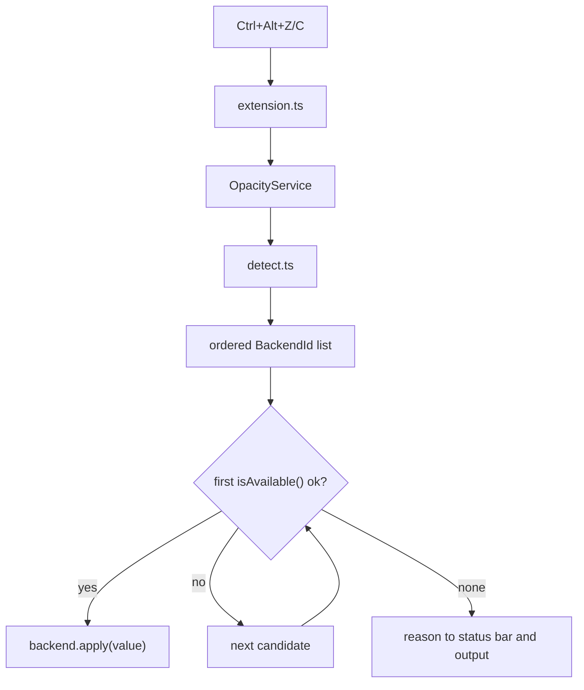

# Architecture

Diffuse is a UI-only VS Code extension that adjusts editor window opacity by
delegating to platform backends.

## Flow



## Core modules

| Module | Role |
|--------|------|
| `src/extension.ts` | Commands, status bar, output channel |
| `src/opacity.ts` | `OpacityService` — config, clamping, persistence, scheduling, backend resolution |
| `src/detect.ts` | Platform/session detection to an ordered candidate list |
| `src/targets.ts` | Single source of truth for editor classes and process names |
| `src/messages.ts` | User-facing strings that are not backend-specific |
| `src/backends/registry.ts` | Maps `BackendId` to `OpacityBackend` |
| `src/backends/index.ts` | `createBackendRegistry()` — single registration point |
| `src/util/exec.ts` | `execCommand`, `tryExec`, `commandExists`, process probes |

## Backend contract

```ts
interface OpacityBackend {
  readonly id: BackendId;
  readonly displayName: string;
  isAvailable(): Promise<Availability>;
  apply(value: number): Promise<ApplyResult>;
  read?(): Promise<number | null>;
}
```

`apply` is **absolute**. Step arithmetic, clamping against
`diffuse.minOpacity`/`maxOpacity`, and `globalState` persistence all live in
`OpacityService`, so a backend only answers "set this window to `value`".

`isAvailable()` returns a `reason` when it says no. That reason is what the user
sees, so each backend explains its own absence instead of a shared string table.

## Resolution

`detectEnvironment()` returns ordered candidates rather than one backend:

| Session | Candidates |
|---------|-----------|
| Wayland + KDE | `kde`, `x11` |
| Wayland + Hyprland | `hyprland`, `x11` |
| Wayland + Sway | `sway`, `x11` |
| Wayland + GNOME | `x11`, `gnome` |
| Wayland, other | `x11` |
| X11, any desktop | `x11` |
| Windows | `windows` |
| macOS | `macos` |

Wayland compositors fall back to `x11` because Electron frequently runs through
XWayland. That fallback is why one generic backend covers XFCE, i3, MATE,
Cinnamon, and most GNOME installs with no per-desktop code.

An explicit `diffuse.backend` bypasses probing entirely — a deliberate override
is trusted.

## Scheduling

Every backend spawns a subprocess and PowerShell costs roughly 300ms per call,
so `OpacityService.flush()` collapses held keypresses: the status bar updates
optimistically, one apply runs at a time, and anything queued during that apply
is coalesced into the latest target value.

## Backends

| Backend | Mechanism |
|---------|-----------|
| `kde` | Ephemeral KWin script over D-Bus, output read from the journal |
| `hyprland` | `hyprctl dispatch setprop`, dialect probed at runtime |
| `sway` | `swaymsg [con_id=…] opacity` |
| `x11` | `xprop -f _NET_WM_WINDOW_OPACITY 32c -set` |
| `gnome` | `gdbus` to the companion GNOME Shell extension in `runtime/gnome/` |
| `windows` | `runtime/win/set-opacity.ps1` — `WS_EX_LAYERED` + `SetLayeredWindowAttributes` |
| `macos` | `yabai -m window --opacity` |

### KDE

1. Materialize `runtime/kwin/set-opacity.js` to a temp file with an injected `DIFFUSE`
   params block carrying the target value and editor classes.
2. Load via D-Bus (`qdbus6` on Plasma 6).
3. Parse `DIFFUSE:` lines from `journalctl _COMM=kwin_wayland + _COMM=kwin_x11`.

No permanent system install — scripts are ephemeral under `/tmp`.

### Hyprland

hyprctl renamed its opacity properties in 0.53. `src/backends/hyprland/dialect.ts`
holds both spellings and the backend probes them in order, caching whichever
hyprctl accepts. A future rename is a one-file change.

### GNOME

Mutter exposes no external opacity API and `Shell.Eval` has been locked since
GNOME 41, so native-Wayland windows can only be dimmed from inside the Shell
process. `runtime/gnome/extension.js` exports
`org.gnome.Shell.Extensions.Diffuse` on the session bus; the backend calls it
with `gdbus`. Installation is user-elected via
**Diffuse: Install GNOME Shell Extension**.

### macOS

There is no public API for another application's window alpha. yabai's
`--opacity` needs its scripting addition with SIP partially disabled, so the
backend detects yabai, probes it, and reports yabai's own error text when the
probe fails. Diffuse never installs or configures yabai.

## Adding a backend

1. Implement `OpacityBackend` in `src/backends/<name>/`.
2. Register it in `createBackendRegistry()` in `src/backends/index.ts`.
3. Add the `BackendId` to `src/backends/types.ts` and the `diffuse.backend` enum
   in `package.json`.
4. Add it to the candidate list in `src/detect.ts`.
5. Resolve the target window through `src/targets.ts`, never a local list.
6. Manual test on the target platform.
