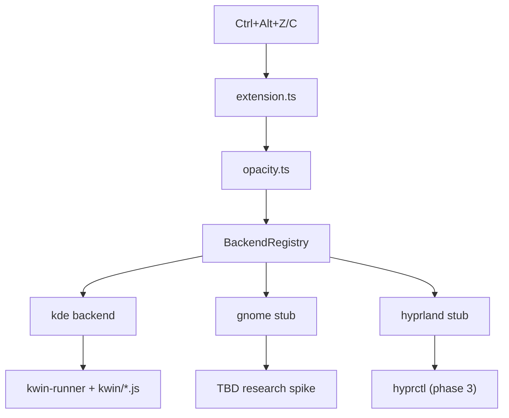

# Architecture

Diffuse is a UI-only VS Code extension that adjusts editor window opacity on Linux by delegating to desktop-environment backends.

## Flow



## Core modules

| Module | Role |
|--------|------|
| `src/extension.ts` | `DiffuseContext` — commands, status bar, output channel |
| `src/detect.ts` | Declarative `DESKTOPS` table → session + backend detection |
| `src/opacity.ts` | Config, stored opacity, orchestrates backend adjust |
| `src/backends/registry.ts` | Maps backend ID → `OpacityBackend` |
| `src/backends/index.ts` | `createBackendRegistry()` — single registration entry point |
| `src/backends/unsupported.ts` | Shared stub for unimplemented backends |
| `src/backends/kde/` | KDE Plasma Wayland via ephemeral KWin scripts |
| `src/util/exec.ts` | Shared shell helpers (`commandExists`, `execCommand`) |

## Backend interface

Each backend implements `OpacityBackend`:

- `id` — matches a `BackendId` (`kde`, `gnome`, `hyprland`)
- `adjust(direction, config)` — increase/decrease opacity, return new value or throw

Registration happens in `createBackendRegistry()`. The extension imports only that function.

## Detection

`detectEnvironment()` reads `XDG_SESSION_TYPE` and desktop env vars (`XDG_CURRENT_DESKTOP`, etc.) against the `DESKTOPS` table:

```typescript
const DESKTOPS = [
  { id: "hyprland", detect: () => !!process.env.HYPRLAND_INSTANCE_SIGNATURE, supported: false },
  { id: "kde",      detect: () => tokensInclude("kde", "plasma"),              supported: true  },
  { id: "gnome",    detect: () => tokensInclude("gnome", "ubuntu"),             supported: false },
];
```

Wayland + a known desktop sets `backendId` and `supported`. X11 always reports unsupported.

## Status bar vs output channel

The status bar is **backend-agnostic**:

- Supported: `Diffuse: KDE Plasma 85%`
- Unsupported: `Diffuse: GNOME (unsupported)`

Backend details (KWin script version, detection dump) go to the **Diffuse** output channel via `Diffuse: Show Environment` or on activate.

## KDE backend

1. Materialize `kwin/adjust-opacity.js` to a temp file with injected `DIFFUSE` params block.
2. Load via D-Bus (`qdbus6` on Plasma 6).
3. Parse `DIFFUSE:` lines from `journalctl _COMM=kwin_wayland`.
4. Persist opacity in extension `globalState`.

No permanent system install — scripts are ephemeral under `/tmp`.

## Adding a backend

1. Implement `OpacityBackend` in `src/backends/<name>/`.
2. Register in `createBackendRegistry()` in `src/backends/index.ts`.
3. Set `supported: true` for the matching entry in `DESKTOPS` (`src/detect.ts`).
4. Add user-facing messages in `src/messages.ts` if needed.
5. Manual test on the target compositor.

**GNOME (phase 2):** likely blocked until Mutter exposes an external opacity API — stub stays until a research spike completes.

**Hyprland (phase 3):** reuse `src/util/exec.ts` for `hyprctl` calls; flip `supported: true` in `DESKTOPS`.
